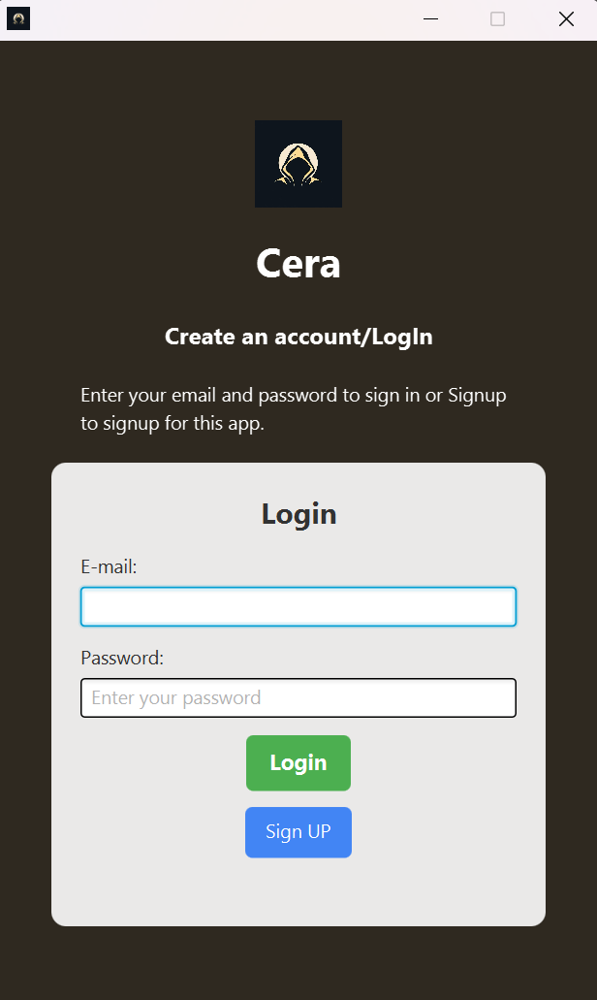

[](https://adoptopenjdk.net/)
[](#license)
[](#)

# CERA (Campus Emergency Reporting App)

CERA is a modern JavaFX desktop application with a mobile view, designed for university campuses in Ghana to securely report incidents, either anonymously or with identification. The app provides a safe, user-friendly platform for students and staff to report emergencies, view reports, and for admins to manage and resolve cases.

---

## Features

- **Anonymous & Identified Reporting:**
  - Submit incident reports without revealing your identity, or log in to report with your user account.
- **Rich Report Details:**
  - Attach images, documents, audio, or video files to provide detailed evidence.
  - Select incident category, location, and provide a description.
- **Admin Dashboard:**
  - Admins can view all reports in a table, mark them as resolved, and see attachments.
- **User Report View:**
  - Users can view all reports, filter by category, and see the status (e.g., Resolved, Under Investigation).
- **Modern, Clean UI:**
  - Intuitive navigation, visually distinct info boxes, and responsive layouts.

---

## Screenshots

### Login Screen



### Home Screen


### Report Form


### Report View


### Admin View


---

## Getting Started

### Prerequisites

- Java 17 or newer
- Maven 3.6+
- JavaFX SDK (if not using Maven dependencies)

### Setup & Run

1. **Clone the repository:**
   ```bash
   git clone <your-repo-url>
   cd cera
   ```
2. **Build the project:**
   ```bash
   mvn clean install
   ```
3. **Run the application:**
   ```bash
   mvn javafx:run
   ```

---

## Running the Application from the Fat JAR (Recommended)

After building the project, you can run the application using the generated fat JAR file. This is the easiest way to distribute and launch the app on any machine with Java and JavaFX installed.

### Prerequisites

- Java 11 or newer (Java 17+ recommended)
- JavaFX SDK (download from https://gluonhq.com/products/javafx/)

### Steps

1. **Build the fat JAR:**

   ```bash
   mvn clean package
   ```

   This will generate `target/cera-1.0.jar` (the fat JAR with all dependencies).

2. **Run the JAR:**

   ```bash
   java --module-path "C:/Program Files/Java/javafx-sdk-24.0.1/lib" --add-modules javafx.controls,javafx.fxml -jar target/cera-1.0.jar
   ```

   - Replace the path after `--module-path` with the location of your JavaFX SDK's `lib` folder if different.
   - On Linux/Mac, use `/path/to/javafx-sdk-XX/lib` as appropriate.

3. **Troubleshooting:**
   - If you see an error about missing JavaFX runtime components, double-check your JavaFX SDK path and that you have the correct version for your OS and Java version.

---

## Default Admin Login

- **Email:** admin@cera.com
- **Password:** admin123

---

## Project Structure

```
cera/
├── src/main/java/com/cera/           # Java source code (controllers, DAOs, App)
├── src/main/resources/com/cera/views/ # FXML UI layouts
├── src/main/resources/com/cera/assets/# Images, icons, screenshots
├── src/main/resources/com/cera/styles/# CSS styles
├── pom.xml                           # Maven build file
└── README.md                         # This file
```

---

## Key Files

- `App.java` — Main JavaFX application entry point
- `controller/` — All UI controllers (Home, Login, Report, Admin, etc.)
- `views/` — FXML files for each screen
- `assets/` — Icons, images, and screenshots
- `Database.java` — Handles SQLite DB setup and connection
- `UserDAO.java`, `ReportDAO.java` — Data access for users and reports

---

## Customization & Theming

- Modify FXML files in `views/` for layout changes
- Update styles in `styles/` for colors, fonts, and more
- Add or replace images in `assets/`

---

## Future Advancements

CERA is designed with scalability and modern campus safety needs in mind. Here are planned enhancements and future development directions:

### 🔐 **Security & Authentication Enhancements**

- **Multi-Factor Authentication (MFA):** SMS/email verification codes for enhanced security
- **Password Hashing:** Implement bcrypt or Argon2 for secure password storage
- **Session Management:** Automatic logout after inactivity, session tokens
- **Role-Based Access Control:** Multiple admin levels (super admin, department admin, security staff)
- **Audit Logging:** Track all user actions for security compliance

### 📱 **Mobile & Cross-Platform Development**

- **Android/iOS Mobile App:** Native mobile applications for better accessibility
- **Progressive Web App (PWA):** Web-based version with offline capabilities
- **Responsive Web Interface:** Browser-based access for all devices
- **Push Notifications:** Real-time alerts for new reports and status updates
- **Offline Mode:** Submit reports without internet connection, sync when online

### 🚨 **Emergency Response Integration**

- **Real-Time Emergency Alerts:** Instant notifications to campus security and emergency services
- **GPS Location Tracking:** Automatic location detection for emergency reports
- **Emergency Contact Integration:** Direct connection to campus security, police, and medical services
- **Live Video/Audio Streaming:** Real-time media streaming for active incidents
- **Emergency Broadcast System:** Campus-wide alerts for critical situations

### 🤖 **AI & Machine Learning Features**

- **Automated Report Classification:** AI-powered categorization of incident types
- **Sentiment Analysis:** Detect urgency levels and emotional content in reports
- **Pattern Recognition:** Identify recurring incidents and hotspots
- **Predictive Analytics:** Forecast potential security risks based on historical data
- **Smart Routing:** Automatically assign reports to appropriate departments

### 📊 **Advanced Analytics & Reporting**

- **Interactive Dashboards:** Real-time statistics and trend analysis
- **Custom Report Generation:** Exportable reports for administrators and stakeholders
- **Heat Maps:** Visual representation of incident locations and frequency
- **Trend Analysis:** Historical data analysis and seasonal patterns
- **Performance Metrics:** Response time tracking and resolution statistics

### 🔄 **Workflow & Process Management**

- **Escalation System:** Automatic escalation for high-priority incidents
- **Assignment & Tracking:** Assign reports to specific security personnel
- **Status Updates:** Real-time status tracking with automated notifications
- **Follow-up System:** Scheduled follow-ups for unresolved cases
- **Resolution Documentation:** Detailed resolution reports and action taken

### 🌐 **Integration & Connectivity**

- **Campus Management System Integration:** Connect with existing university systems
- **API Development:** RESTful APIs for third-party integrations
- **Database Migration:** Support for PostgreSQL, MySQL, and cloud databases
- **Cloud Deployment:** AWS, Azure, or Google Cloud hosting options
- **Multi-Campus Support:** Centralized management for multiple university locations

### 📋 **Enhanced Reporting Features**

- **Template-Based Reports:** Pre-defined templates for common incident types
- **Rich Text Editor:** Enhanced text formatting and media embedding
- **Voice-to-Text:** Speech recognition for hands-free reporting
- **Multi-Language Support:** Localization for different regions and languages
- **Anonymous Follow-up:** Allow anonymous users to provide additional information

### 👥 **Community & Communication**

- **Campus Safety Tips:** Educational content and safety guidelines
- **Community Forums:** Discussion boards for safety concerns (moderated)
- **Safety Campaigns:** Integration with campus safety awareness programs
- **Peer Support System:** Anonymous peer support for mental health incidents
- **Feedback System:** User feedback and satisfaction surveys

### 🔧 **Technical Improvements**

- **Microservices Architecture:** Scalable, maintainable service-based design
- **Containerization:** Docker support for easy deployment
- **CI/CD Pipeline:** Automated testing and deployment
- **Performance Optimization:** Caching, database optimization, and load balancing
- **Backup & Recovery:** Automated backup systems and disaster recovery

### 📈 **Scalability & Performance**

- **Load Balancing:** Handle high traffic during emergency situations
- **Caching Layer:** Redis integration for improved performance
- **Database Optimization:** Query optimization and indexing strategies
- **CDN Integration:** Content delivery network for global accessibility
- **Auto-scaling:** Cloud-based auto-scaling for variable loads

### 🛡️ **Compliance & Legal**

- **GDPR Compliance:** Data protection and privacy regulations
- **FERPA Compliance:** Educational records privacy (for US institutions)
- **Audit Trails:** Comprehensive logging for legal compliance
- **Data Retention Policies:** Automated data archiving and deletion
- **Legal Documentation:** Integration with legal reporting requirements

### 🎨 **User Experience Enhancements**

- **Dark/Light Theme:** User preference for interface themes
- **Accessibility Features:** Screen reader support, keyboard navigation
- **Customizable Dashboard:** Personalized user interfaces
- **Quick Actions:** One-click reporting for common incidents
- **Tutorial System:** Interactive guides for new users

---

## Contributing

We welcome contributions to enhance CERA's capabilities! Please see our contributing guidelines for:

- Code standards and best practices
- Feature request submission process
- Bug reporting procedures
- Development environment setup

---

## License

This project is for educational and demonstration purposes. Please contact the author for other uses.
